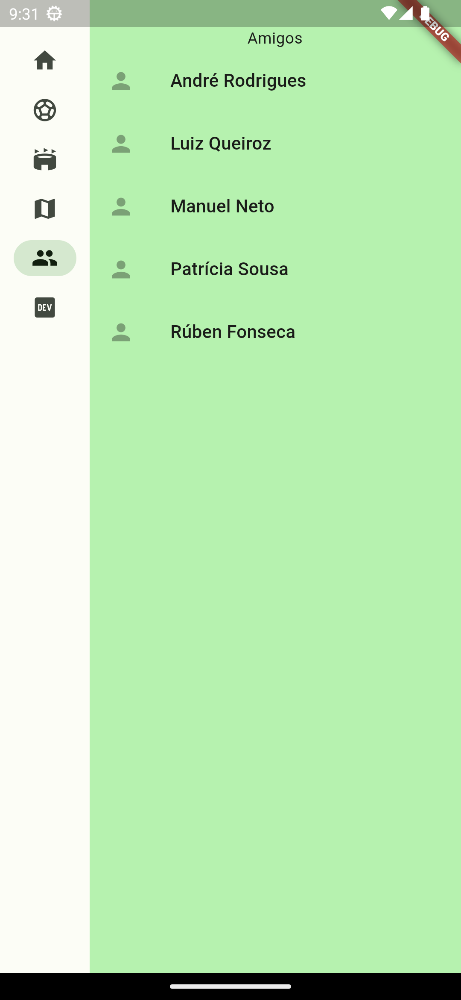

## Architecture and Design

### Logical architecture

**FootLinker GUI:** module responsible for drawing the FootLinker app and allowing interation between the user and the app

**FootLinker Business Logic:** module responsible for the app logic

**Firebase (Database):** module responsible for cloud storage (database) and users' authentication

**API-Footbal:** external API responsible for supplying all information related to football (fixtures, leagues, teams, venues, ...)

**Google Maps API:** external API responsible for location services and giving directions to stadiums

### Physical architecture

**User Smartphone:** end-users' point of access to FootLinker mobile application

*FootLinker Application (Flutter):* mobile application developed using Flutter framework

**Firebase Server:** online server used for cloud storage (FireStore) and users' authentication

*Application Business Logic Services:* logic behind the operation of the integration/connection between FootLinker Application, User Database, API-Footbal and Google Maps API

*User Database (NoSQL):* cloud storage of all users registered in the FootLinker Application and their relevant information

**API-Football Server:** host server of API-Football

*API-Football:* API used for retrieving all data related to football (such as fixtures, venues and matches, for example), selected due to the wide range of data it provides with consistency and quality

**Google Server:** host server of Google Maps API

*Google Maps API:* API used for searching stadiums' locations and matches nearby, selected due to being the most easy-to-use and well-known API found about location services

### Vertical prototype

We have implemented a vertical prototype with six screens and a navigation bar.

The first screen ("home") is just a temporary screen that, in the future, will be the main page of the app.

The second screen ("teams") shows the user's favorite club, fetched from the football API given a hardcoded ID.

The third screen ("venues") shows that club's stadium, also fetched from the football API given the team ID.

The fourth screen ("map") contains a usable Google Maps interface, temporarily centered on the location of Estádio do Dragão, given its hardcoded coordinates.

The fifth screen ("friends") lists the user friends that, for now, are simply fetched from a database of names and surnames hosted on Firebase cloud storage (FireStore).

The sixth and last screen ("credits") lists the names of the authors of the apps, i. e., our names.

