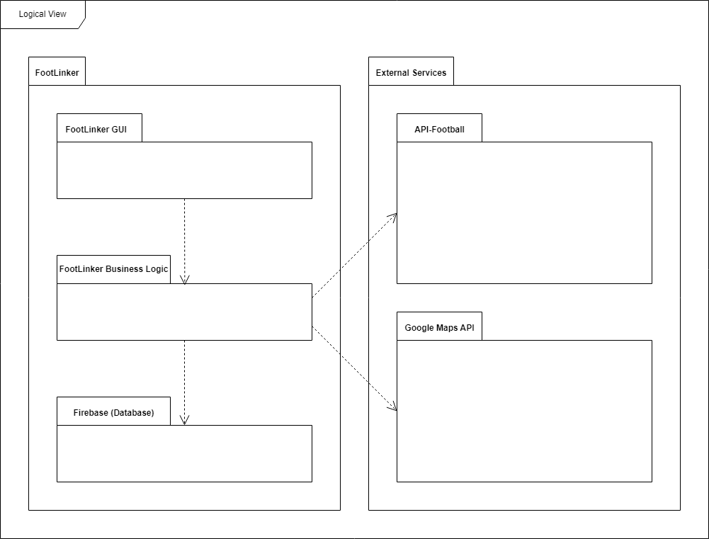
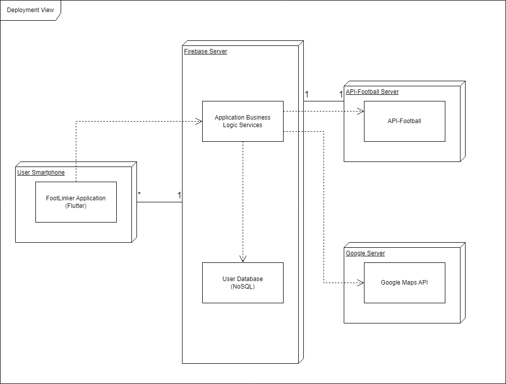

## Architecture and Design

### Logical architecture

**FootLinker GUI:** module responsible for drawing the FootLinker app and allowing interation between the user and the app

**FootLinker Business Logic:** module responsible for the app logic

**API-Footbal:** external API responsible for supplying all information related to football (fixtures, leagues, teams, venues, ...)

**Google Maps API:** external API responsible for location services and giving directions to stadiums

**Firebase:** external server responsible for cloud storage and users' authentication

### Physical architecture

**User Smartphone:** end-users' point of access to FootLinker mobile application

*FootLinker Application (Flutter):* mobile application developed using Flutter framework

**Firebase Server:** online server used for cloud storage (FireStore) and users' authentication

*Application Business Logic Services:* logic behind the operation of the integration/connection between FootLinker Application, User Database, API-Footbal and Google Maps API

*User Database (NoSQL):* cloud storage of all users registered in the FootLinker Application and their relevant information

**API-Football Server:** host server of API-Football

*API-Football:* API used for retrieving all data related to football (such as fixtures, venues and matches, for example), selected due to the wide range of data it provides with consistency and quality

**Google Server:** host server of Google Maps API

*Google Maps API:* API used for searching stadiums' locations and matches nearby, selected due to being the most easy-to-use and well-known API found about location services

### Vertical prototype
To help on validating all the architectural, design and technological decisions made, we usually implement a vertical prototype, a thin vertical slice of the system.

In this subsection please describe which feature you have implemented, and how, together with a snapshot of the user interface, if applicable.

At this phase, instead of a complete user story, you can simply implement a feature that demonstrates thay you can use the technology, for example, show a screen with the app credits (name and authors).

