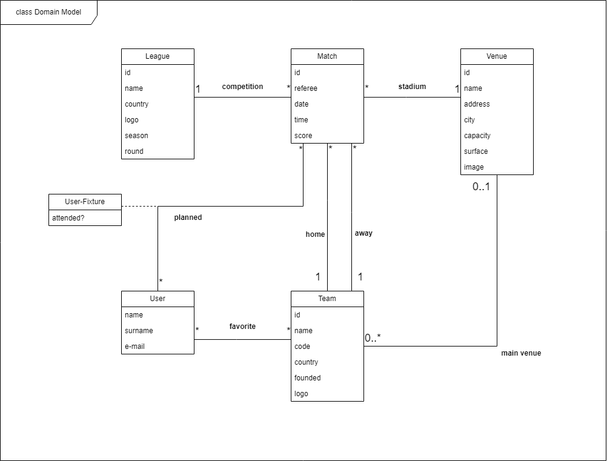

## Requirements

### Domain model

**Match:** A match is a football fixture between two teams ("home" and "away") played at certain date and time, at a stadium which usually is the venue of the "home" team (if it has one). It is uniquely identified by an id, has a referee and, after full-time, it has a score reflecting how many goals each team scored.

**League:** A league is a competition with its own rules, which applies to its fixtures, i. e., all fixtures of a league follow a certain pattern (for example, fixtures of a league are usually played at that league's country). It is uniquely identified by an id, has a name and a logo. A league is played in a season and it can have one or more rounds (such as "normal round", "relegation round" or "promotion round").

**Team:** A team is the core of football: it is a group of players who play football matches (fixtures), representing a club of a country. It is uniquely identified by an id, has a name, a code (like an acronym), a foundation date and a logo.

**User:** A user is a person with a name, a surname and an e-mail which uses the FootLinker app. He/She can have favorite teams and plan to attend fixtures. The User-Fixture association-class represents if the user has indeed attended a certain fixture.

**Venue:** A venue is the stadium where a match is played. It is uniquely identified by an id, has a name, an address, a city and an image. Each venue has its own capacity (number of seats) and its surface kind (usually, grass).  

  

